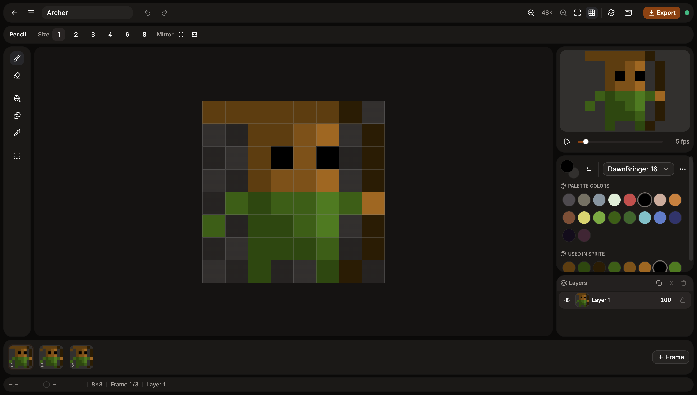
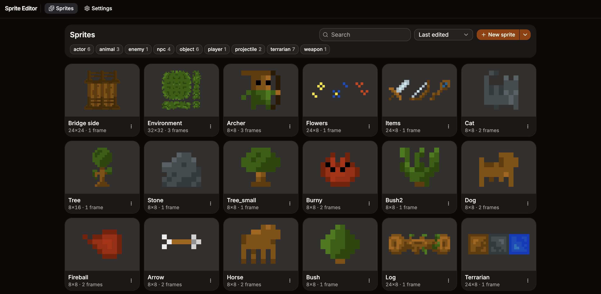
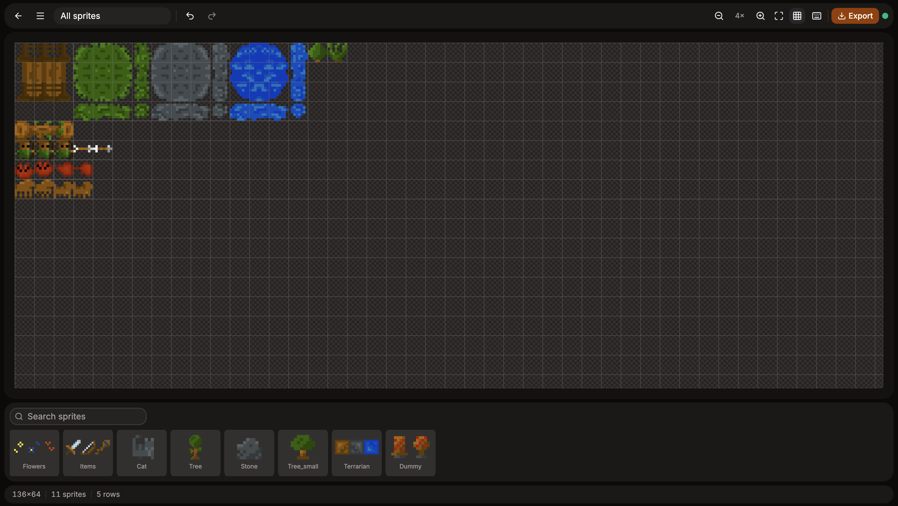
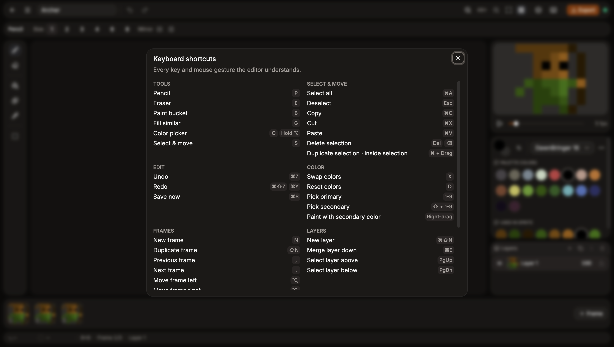

# Easy Sprite

[](https://sabeq96.github.io/easy-sprite/)
[](https://github.com/sabeq96/easy-sprite/actions/workflows/deploy-pages.yml)
[](LICENSE)
[](CONTRIBUTING.md)

**Pixel art without the ceremony.** Open a tab, start drawing, animate it, export a spritesheet for your game. No account, no install, no cloud. Everything stays in your browser.

**👉 [Try it now at sabeq96.github.io/easy-sprite](https://sabeq96.github.io/easy-sprite/)**

Easy Sprite is a local-first pixel-art editor and animator, built by a developer for developers who just want to get sprites into their game and get back to coding.

---

## Why this exists

Easy Sprite is an **off-hours project**, built in evenings and weekends because I wanted a sprite tool that's quick, keyboard-driven, and stays out of the way. It's built **with open source in mind**: the code is here.

It's made **from developer, for developers**. If something annoys you, it probably annoys me too. Tell me about it.

## Features

- **Sprite editor**
  - **Drawing tools**

  - **Layers**
  - **Frames & animation**
  - **Palettes**

- **Library**
- **Spritesheet builder**
- **PNG export**
- **Local-first storage & backups**
- **Keyboard shortcuts**

## Screenshots

### Editor

Draw with a pencil (sizes 1–8, with mirroring), eraser, paint bucket, fill similar, color picker, and select & move. Stack layers, add frames, and watch the animation play in the live preview. Switch between built-in or custom color palettes, and see the colors your sprite already uses.



### Library

Every sprite and spritesheet in one place, with thumbnails. Search, filter by tags, sort, and rename, duplicate, or delete them. It's all stored locally in your browser and autosaved.



### Spritesheet builder

Drag sprites onto a shared grid, arrange them however you like, and export one PNG that's ready to drop into your engine.



### Keyboard shortcuts

Every key and mouse gesture the editor understands, one keypress away.



## For developers

```bash
git clone git@github.com:sabeq96/easy-sprite.git
cd easy-sprite
npm install
npm run dev
```

Then open the URL Vite prints (usually <http://localhost:5173>).

### Useful scripts

| Command                | What it does                        |
| ---------------------- | ----------------------------------- |
| `npm run dev`          | Start the dev server with HMR       |
| `npm run build`        | Type-check and build for production |
| `npm run preview`      | Serve the production build locally  |
| `npm run lint`         | Lint with Oxlint                    |
| `npm test`             | Run unit tests                      |
| `npm run test:browser` | Run browser tests                   |
| `npm run test:all`     | Run the whole test suite            |

## Tech stack

React 19 · TypeScript · Vite · Tailwind CSS 4 · shadcn/ui (Base UI) · Zustand · Dexie (IndexedDB) · Canvas 2D · Vitest

Architecture notes, conventions, and design docs live in [docs/](docs/).

## Contributing

This is a side project, so progress follows free time. Feedback still shapes where it goes, so please get involved:

- 🐛 **Found a bug?** [Open an issue](https://github.com/sabeq96/easy-sprite/issues/new/choose) with steps to reproduce.
- 💡 **Have an idea?** Feature requests are very welcome, big or small.
- 🎨 **Made something with it?** Share it in an issue. I'd love to see it.
- 🔧 **Want to hack on it?** PRs are welcome. For bigger changes, open an issue first so we can talk it through. See [CONTRIBUTING.md](CONTRIBUTING.md) to get started.

No contribution is too small. A typo fix or a "this felt weird" report helps too.

## License

[MIT](LICENSE). Use it, fork it, ship it.

---

_Made with ☕ after hours._
