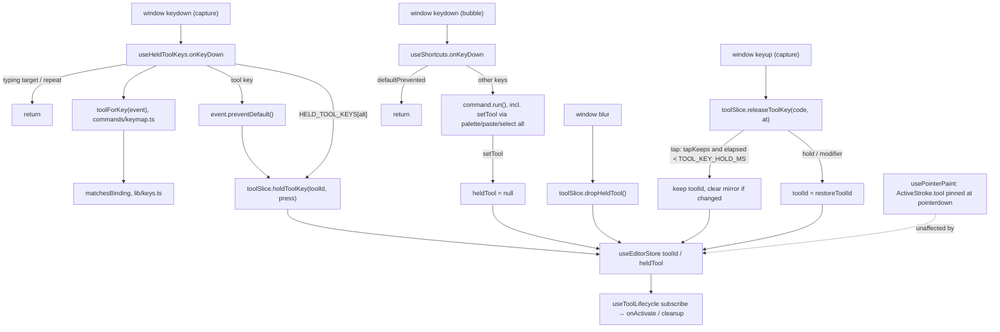

# Hold tool shortcuts (spring-loaded tool keys)

Status: proposed
Date: 2026-09-30
Issue: #5 "Eraser Holding Shortcut"

## Goal
In the pixel editor, every tool key (`P`, `E`, `B`, `G`, `O`, `S`) is spring-loaded:

- Keydown switches to the tool at once, as it does today.
- On keyup, a press shorter than `TOOL_KEY_HOLD_MS` (300 ms) was a tap, so the tool stays.
- A longer press was a hold, so the tool that was active before the hold comes back, with its
  options (mirror included) unchanged.

The hold-`Alt` temporary picker runs on the same machinery. The slice holds one piece of state
(`heldTool`) for "which key borrowed a tool, and what to hand back", with one path through it. The
parallel `previousToolId` / `pushTemporaryTool` / `popTemporaryTool` path goes away.

## Non-goals
- No setting or UI for the threshold. It is a constant.
- No "revert only if a stroke happened during the hold" safeguard (Decision 2; deferred).
- No spring-loading in the spritesheet builder: it has no tools, and `useHeldToolKeys` stays editor-only.
- No new bindings. No change to `APP_SHORTCUTS`, to `Tool.shortcut` / `Tool.holdKey` values, or to
  the tool commands' `run` (sidebar clicks, the command palette, Paste and Select all still call `setTool`).
- No deferring of a revert until the current stroke ends (Decision 12; listed as an open question).
- No borrow stack. Only one held tool at a time.
- Borrowing any tool while Select & move is active still drops the selection. `Alt` does this today,
  because the selection only exists while its tool is active.
- No per-tool "Hold X" text in sidebar tooltips.
- The stale rows in `docs/shortcuts.md` (`P` "press again to cycle brush size", `V` Mirror pencil)
  are not fixed here (Open question 3).

## Decisions
| # | Decision | Why | Rejected alternative |
|---|----------|-----|----------------------|
| 1 | **Settled by the maintainer.** The threshold is `TOOL_KEY_HOLD_MS = 300` in `src/constants/shortcuts.ts`. `keyup.timeStamp − keydown.timeStamp ≥ 300` counts as a hold. No timer | Both events share one time origin, and nothing needs to happen *at* 300 ms | `setTimeout` at keydown |
| 2 | Pure time threshold | Maintainer preference. It is predictable, and "hold O, look, let go" still reverts | Revert only if a stroke happened during the hold. It needs a signal from `usePointerPaint`'s closure. Deferred |
| 3 | **Settled by the maintainer.** Every tool with a `shortcut` takes part, Select & move included. Its key in code is **`S`** (`selectTool.shortcut`), not `M` | One rule for every tool key | An opt-out flag on `Tool` (dropped: nothing opts out) |
| 4 | **Settled by the maintainer. One mechanism.** The slice's `heldTool: HeldTool \| null` replaces `previousToolId`. `holdToolKey` / `releaseToolKey` / `dropHeldTool` replace `pushTemporaryTool` / `popTemporaryTool`. The tap/hold decision is a pure slice transition, and `useHeldToolKeys` is thin wiring for both tool keys and `Alt` | One place owns the state, so nothing can go stale between a hook's copy and the store's. The rule is unit-testable with plain numbers (conventions §7: hooks don't own algorithms) | Keeping push/pop plus a second record in the hook (two sources of truth: `Alt` keyup would pop an `E` hold) |
| 5 | `HELD_TOOL_KEYS`, `Tool.holdKey`, `HeldModifier` and `toolKeys()` **stay**. They declare *which* modifier borrows *which* tool and render "Hold ⌥". Only the runtime path changes | The declaration is still true and still displayed | Folding `holdKey` into `shortcut` |
| 6 | **Alt has no tap.** A hold started by a modifier records `tapKeeps: false`, so its release always hands back, whatever the elapsed time | That is today's UX. A modifier tapped on its own must never switch tools for good | Applying the threshold to `Alt` (a quick `Alt` tap would leave the picker on) |
| 7 | Keydown **borrows** without touching `toolOptions`. A tap resolves as a real choice with `setTool`'s semantics (mirror cleared if the tool changed), and a hold restores `restoreToolId` | At keydown, tap and hold can't be told apart. A hold comes back to the pencil with mirror still on, and a tap ends exactly where clicking the tool would | `setTool` on keydown and `setTool(previous)` on a long keyup (the hold would silently switch mirror off) |
| 8 | **Settled by the maintainer. Takeover.** A second held key during a hold replaces the holder: the new tool, the new `code` and a new `pressedAt`, with `restoreToolId` kept from the **first** hold. Releasing the first key then does nothing. The second key's release follows its own tap/hold rule | Overlapping taps (`E↓ B↓ E↑ B↑`) end on `B`, and chained holds return to where you started | Ignoring the second key. A stack |
| 9 | **Alt under takeover.** `Alt` pressed during an `E` hold is a second held key: the picker takes over, and releasing `Alt` returns to the tool from before `E` (the release of `E` is then a no-op). `E` pressed during an `Alt` hold is **not** a tool key, because `Alt+E` is a different chord (Decision 11) and on macOS composes a character | One rule for every held key. Exact chords stop `Alt+letter` from ever being claimed | `Alt` over `E` returning to `E` (needs a stack. Open question 1). Treating `Alt+E` as `E` |
| 10 | `useHeldToolKeys` listens in the **capture** phase on `window` and `preventDefault()`s every tool-key keydown it matches, repeats included. `useShortcuts` returns early on `event.defaultPrevented` | A capture listener on `window` runs before any bubble listener, whatever order the effects registered in. If `useShortcuts` also ran `setTool`, it would end the hold at once. The codebase already uses `defaultPrevented` to mean "claimed" (Space-drag vs `usePointerPaint`) | Relying on hook call order in `EditorShell`. `stopImmediatePropagation` (would kill menu typeahead). Dropping tool keys from `SHORTCUTS` (breaks the chord-uniqueness test and the cheat sheet) |
| 11 | A keydown matches with `matchesBinding(event, tool.shortcut)`, so `⌘/Ctrl+E`, `Shift+E` and `Alt+E` are never tool keys. The release matches on **`event.code`**, which is also stored for `Alt` (`AltLeft`/`AltRight`) | `event.key` of a held letter changes if Shift or Option joins mid-hold. The physical key doesn't | Matching the release on `event.key` |
| 12 | Releasing mid-stroke is safe without any deferral. `usePointerPaint` pins `ActiveStroke.tool` at pointerdown and routes every move and up through it. A revert doesn't touch `toolOptions`, and a tap only clears mirror, which the borrowed tool doesn't read, so paint tools, fills and the picker finish the stroke with the borrowed tool as one undo entry. **Select** is the exception: releasing `S` mid-drag deactivates it, `abandonDrag` puts lifted pixels back, and later moves and the pointerup are no-ops (`state.drag` is null). The recorder has no `extend`, so `commit()` returns null: no undo entry and no data lost, but the move is cancelled | Verified in `usePointerPaint.ts`, `select.ts` and `StrokeRecorder.commit` | Deferring the revert to pointerup. It needs stroke state shared out of `usePointerPaint` (Open question 2) |
| 13 | `setTool` (sidebar, palette, Paste, Select all) clears `heldTool`. The pending release is then a no-op | An explicit choice beats a key that happens to be held. With one state, there is nothing else to invalidate | Reverting anyway on keyup |
| 14 | A key for the tool already active starts no hold (holding `P` on the pencil does nothing), unless a hold is already running. In that case it takes over like any key (Decision 8) | Nothing to hand back | — |
| 15 | Repeats are ignored: only the first keydown starts the clock. Window `blur` calls `dropHeldTool()` (hand back, whatever the elapsed time) | Issue requirement. The keyup may never arrive | Treating a blur within 300 ms as a tap |
| 16 | Keydown in a typing target is ignored and not claimed. Keyup is **not** filtered | A release that lands after focus moved into a field must still resolve | Filtering keyup too (the tool would stay borrowed) |
| 17 | Cheat sheet: one row at the end of the leading **Tools** section, "Use a tool until you let go" / "Hold tool key". It is a `Hint` exported from `useHeldToolKeys.ts` | Hints live next to their code. Joining the `"Tools"` `CommandGroup` would render a second "Tools" heading | "Hold X" on every tool row and tooltip |
| 18 | The tap/hold logic is unit-tested on the slice with explicit timestamps. The hook's browser tests dispatch `KeyboardEvent`s with `timeStamp` overridden (`tests/support/keys.ts`) | Deterministic, with no 300 ms sleeps. Fake timers don't move `event.timeStamp` | Real waits |

## Call graph


## Interfaces
```ts
// src/constants/shortcuts.ts
/** A tool key held at least this long borrows the tool; a shorter press switches to it for good. */
export const TOOL_KEY_HOLD_MS = 300;

// src/stores/slices/toolSlice.ts
export interface HeldTool {
  /** The physical key holding the tool (`KeyboardEvent.code`); only its release resolves the hold. */
  code: string;
  /** `KeyboardEvent.timeStamp` of that key's first keydown. */
  pressedAt: number;
  /** Tool keys: a release before TOOL_KEY_HOLD_MS keeps the tool. Modifiers (Alt) always hand back. */
  tapKeeps: boolean;
  /** The tool active before the first key of this hold; kept through a takeover. */
  restoreToolId: ToolId;
}
export interface KeyPress { code: string; at: number; tapKeeps: boolean }

export interface ToolSlice {
  toolId: ToolId;
  heldTool: HeldTool | null;              // replaces previousToolId
  toolOptions: ToolOptions;
  setTool: (toolId: ToolId) => void;      // now also clears heldTool
  holdToolKey: (toolId: ToolId, press: KeyPress) => void;   // replaces pushTemporaryTool
  releaseToolKey: (code: string, at: number) => void;       // replaces popTemporaryTool
  dropHeldTool: () => void;               // blur: hand back unconditionally
  setToolOptions: …; cycleBrushSize: …;   // unchanged
}
// removed: previousToolId, pushTemporaryTool, popTemporaryTool
// setTool and the tap path share a colocated `withoutMirror(options)` helper.

// src/commands/keymap.ts (HELD_TOOL_KEYS, toolKeys unchanged)
/** The tool whose exact `shortcut` chord this keydown is (so ⌘E is not E), or null. */
export function toolForKey(event: KeyboardEvent): ToolId | null;

// src/hooks/useHeldToolKeys.ts
export const TOOL_KEY_HOLD_HINT: Hint; // { action: "Use a tool until you let go", inputs: [{ text: "Hold tool key" }] }
export function useHeldToolKeys(): void; // signature unchanged
```

Slice transitions (sketch):
```ts
holdToolKey(toolId, { code, at, tapKeeps }):
  const { toolId: current, heldTool } = get();
  if (heldTool?.code === code) return;                          // same key again
  if (!heldTool && toolId === current) return;                  // Decision 14
  set({ toolId, heldTool: { code, pressedAt: at, tapKeeps,
        restoreToolId: heldTool?.restoreToolId ?? current } });  // Decision 8: takeover keeps the first restore

releaseToolKey(code, at):
  const { heldTool, toolId, toolOptions } = get();
  if (!heldTool || heldTool.code !== code) return;              // not the holder, or already cleared
  const tap = heldTool.tapKeeps && at - heldTool.pressedAt < TOOL_KEY_HOLD_MS;
  set(tap
    ? { heldTool: null, toolOptions: toolId === heldTool.restoreToolId ? toolOptions : withoutMirror(toolOptions) }
    : { heldTool: null, toolId: heldTool.restoreToolId });

dropHeldTool():
  const { heldTool } = get(); if (heldTool) set({ heldTool: null, toolId: heldTool.restoreToolId });
```

Hook (sketch). It has no state of its own.
```ts
onKeyDown(e):                                    // { capture: true }
  if (isTypingTarget(e.target)) return;
  const keyTool = toolForKey(e);
  if (keyTool) e.preventDefault();               // claimed, repeats included
  if (e.repeat) return;
  const toolId = keyTool ?? HELD_TOOL_KEYS[e.key.toLowerCase() as HeldModifier];
  if (toolId) store().holdToolKey(toolId, { code: e.code, at: e.timeStamp, tapKeeps: keyTool !== null });
onKeyUp(e):  store().releaseToolKey(e.code, e.timeStamp);   // { capture: true }, no typing filter
onBlur():    store().dropHeldTool();
```

## Files
- `src/constants/shortcuts.ts`: add `TOOL_KEY_HOLD_MS`. Serves 1.
- `src/stores/slices/toolSlice.ts`:
  - Add the `HeldTool` and `KeyPress` types and the `heldTool` state.
  - Add `holdToolKey`, `releaseToolKey` and `dropHeldTool`.
  - `setTool` also clears `heldTool`, and `withoutMirror` is extracted for it and the tap path to share.
  - Remove `previousToolId`, `pushTemporaryTool` and `popTemporaryTool`, and update the `setTool` doc comment.

  Serves 1–7.
- `src/commands/keymap.ts`: `toolForKey`. Serves 1, 6.
- `src/hooks/useHeldToolKeys.ts`: rewritten as the thin wiring above (capture listeners), plus `TOOL_KEY_HOLD_HINT` and an updated doc comment. Serves 1–7.
- `src/hooks/useShortcuts.ts`: return early on `event.defaultPrevented`, with a comment naming the claim. Serves 1.
- `src/components/editor/ShortcutHelpDialog.tsx`: append `hintRow(TOOL_KEY_HOLD_HINT)` to `TOOLS_ROWS`. Serves 8.
- `src/editor/tools/types.ts`: update the `holdKey` doc ("borrowed through the same hold as tool keys; its release always hands back"). Serves 5.
- `grep` for any other reader of `previousToolId` / `push|popTemporaryTool` (today there are none outside the slice and its test).
- `docs/shortcuts.md`:
  - Tools table intro: "Tap a tool key to switch; hold it for 0.3 s or longer to use the tool until you let go."
  - Update the `S` note: releasing a held `S` drops the selection, and mid-drag cancels the move.
  - Update the `O` note: `Alt` and a held `O` both borrow the picker.
  - Implementation contract: tool keys are claimed by `useHeldToolKeys` via `preventDefault` (so `useShortcuts` skips them), and `Alt` shares the same hold. Rule 1 gets its one exception: a tapped tool key has its command's effect without calling `run()`.

  Serves 9.
- Tests are listed below. Serves 10.

## Test plan
Unit (`npm test`):
- `tests/unit/stores/toolSlice.test.ts`. Migrate the three push/pop tests and the mirror test to the new API, then add:
  1. Tap: `holdToolKey("eraser", {code:"KeyE", at:0, tapKeeps:true})` then `releaseToolKey("KeyE", 299)` → eraser, `heldTool` null, mirror cleared.
  2. Hold: the release at 300 → pencil, mirror intact.
  3. Alt: `tapKeeps:false`, released at 10 → pencil.
  4. Takeover: E at 0, B at 50, then release KeyE at 80 → still bucket, and release KeyB at 120 → bucket (tap).
  5. Takeover with a hold: E at 0, B at 400, release KeyE at 500 → no-op, and release KeyB at 900 → pencil.
  6. Alt over E: E at 0, AltLeft at 100 → picker. Release AltLeft at 150 → pencil, and a later release of KeyE is a no-op.
  7. A foreign code release is a no-op.
  8. `dropHeldTool` restores.
  9. `setTool` during a hold clears `heldTool`, and the release is a no-op.
  10. Holding the active tool's key is a no-op.
  11. Holding select from the pencil and tapping ends on select.
- `tests/unit/commands/keymap.test.ts`, `toolForKey`:
  - `{key:"e"}` → eraser, and `{key:"s"}` → select.
  - `{key:"e"}` with `ctrlKey` or `metaKey` → null, with `shiftKey` (`"E"`) → null, and with `altKey` → null.
  - Every tool's `shortcut` resolves to that tool.
  - The existing `HELD_TOOL_KEYS` / `toolKeys` tests stay green.

Browser (`npm run test:browser`):
- `tests/support/keys.ts` (new): `keyDown(key, { code, at, repeat?, altKey?, target? })` and `keyUp(…)`
  dispatch a bubbling, cancelable `KeyboardEvent` with `timeStamp` overridden, and return it.
- `tests/browser/hooks/useHeldToolKeys.browser.test.tsx` (new). The harness renders
  `useHeldToolKeys()` plus `useShortcuts(createToolCommands(useEditorStore))` and a text input. Cases:
  - A tap keeps the tool, and a hold hands back.
  - A repeat at 250 doesn't restart the clock.
  - A blur mid-hold hands back.
  - The keydown is `defaultPrevented` for `E` and `S`, but not for `Ctrl+E`, and `Ctrl+E` doesn't switch.
  - `E` in the input: no switch, not claimed.
  - A keyup matched by `code` (`key:"´", code:"KeyE"`) resolves.
  - `Alt` from the pencil: picker, then back on release.
- `tests/browser/hooks/useShortcuts.browser.test.tsx`: add "a keydown already claimed (defaultPrevented) runs nothing".
- `tests/support/pointer.ts` and `tests/support/editor.ts`: add `pressSpritePixel`, exposed as
  `editor.press(point)`. It returns `{ moveTo(point), release() }` so key events can interleave with a stroke.
- `tests/browser/tools/eraser.browser.test.tsx`:
  - "holding E borrows the eraser from the pencil and hands it back".
  - "releasing E mid-stroke keeps erasing to the end of the stroke": the whole path is cleared, the tool is pencil, and one undo restores everything.
- `tests/browser/tools/select.browser.test.tsx`:
  - "releasing a held S mid-move puts the pixels back and adds no undo step".
  - "tapping S keeps Select & move".
- `tests/browser/tools/picker.browser.test.tsx`: the existing Alt test passes **unchanged**. It drives real `{Alt>}` / `{/Alt}` keys.
- `tests/browser/flows/core-editing.browser.test.tsx`:
  - Narrow the `/^Hold /` assertion to `Hold ${formatModifier("alt")}`, since the new row reads "Hold tool key".
  - Assert the "Use a tool until you let go" row.

Command: `npm run lint && npx tsc -b && npm test && npm run test:browser`

## Done when
- [ ] 1. From the pencil, a press of `E` under 300 ms leaves the eraser active, and a press of 300 ms or more returns to the pencil. The same holds for `P`, `B`, `G`, `O` and `S`.
- [ ] 2. A hold returns with mirror settings intact. A tap clears mirror exactly as clicking the tool does.
- [ ] 3. Repeats never restart the clock, and window blur during any hold restores the pre-hold tool.
- [ ] 4. `E↓ B↓ E↑ B↑` (fast) ends on the bucket, and the same sequence held long ends on the pencil.
- [ ] 5. Holding `Alt` still borrows the picker and always hands back on release. `Alt` during an `E` hold takes over and returns to the pre-`E` tool.
- [ ] 6. `E` in a text field, `⌘/Ctrl+E`, `Shift+E` and `Alt+E` never switch tools through this path.
- [ ] 7. `previousToolId`, `pushTemporaryTool` and `popTemporaryTool` no longer exist (`grep` is empty), and `heldTool` is the only hold state.
- [ ] 8. The `?` sheet's Tools section shows "Use a tool until you let go · Hold tool key".
- [ ] 9. `docs/shortcuts.md` describes tap/hold, the Alt unification, the `S` caveat and the `preventDefault` claim.
- [ ] 10. Every test listed above exists, the Alt picker test is unmodified, and the command above passes.

## Open risks
- Linux/X11 auto-repeat has historically produced synthetic keyup/keydown pairs. Chromium filters
  them, but other engines may not, and a long hold there could read as taps. This can't be checked on CI.
- `useShortcuts` now skips *any* `defaultPrevented` keydown. If a Base UI component
  `preventDefault`s `Escape`, `edit.deselect` no longer also fires. The existing Escape tests must stay green.
- The `timeStamp` override on synthetic events is assumed to work in Chromium. If it doesn't,
  `keys.ts` falls back to a real wait of `TOOL_KEY_HOLD_MS`, and only the hook tests need it.

## Open questions for the maintainer
1. **Alt over a held tool key.** The default is uniform takeover: releasing `Alt` returns to the
   pre-`E` tool even while `E` is still down. The alternative is returning to `E`, which needs a
   two-level stack in `heldTool`.
2. **Held `S` released mid-drag.** The default is safe but cancelling: pixels go back and no undo entry is
   made. The alternative is deferring any revert that lands mid-stroke until pointerup, which needs a
   "stroke active" flag published by `usePointerPaint`. The recommendation is to ship the default and
   revisit if the complaint comes up.
3. **Stale keymap rows.** `docs/shortcuts.md` lists `P` "press again to cycle brush size" and a `V`
   Mirror pencil, and neither exists in code. The recommendation is a separate issue.
4. **Stroke-happened safeguard** (Decision 2). It stays deferred. Revisit if long "thinking" taps revert unexpectedly.

## Drift log
