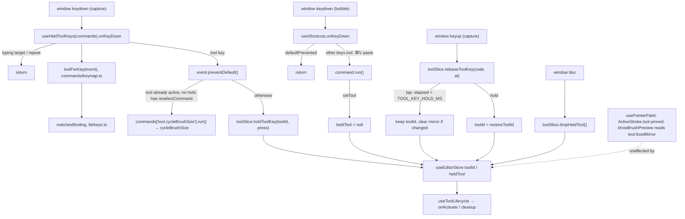

# Hold tool shortcuts (spring-loaded tool keys), `P` again, `V` mirror pencil

Status: proposed
Date: 2026-09-30
Issue: #5 "Eraser Holding Shortcut"

## Goal
In the pixel editor, every tool key (`P`, `V`, `E`, `B`, `G`, `O`, `S`) is spring-loaded:

- Keydown switches to the tool at once, as it does today.
- On keyup, a press shorter than `TOOL_KEY_HOLD_MS` (300 ms) was a tap, so the tool stays.
- A longer press was a hold, so the tool that was active before the hold comes back, with its
  options (mirror included) unchanged.

The hold-`Alt` temporary picker is **removed**. Holding `O` replaces it: it borrows the picker
exactly as holding any other tool key does. With no modifier holds left, the slice holds one piece
of state (`heldTool`) for "which key borrowed a tool, and what to hand back". The
`previousToolId` / `pushTemporaryTool` / `popTemporaryTool` path goes away, and so do
`Tool.holdKey`, `HELD_TOOL_KEYS` and `HeldModifier`.

The same PR makes two rows of `docs/shortcuts.md` true, since neither is wired up today:

- `P` pressed while the pencil is already active cycles the brush size 1→2→3→4. A size above 4
  (6 or 8, picked in the options bar) wraps to 1 (Decision 22).
- `V` selects a new **Mirror pencil** tool, which always draws on both sides of the vertical axis.

## Non-goals
- No setting or UI for the threshold. It is a constant.
- No "revert only if a stroke happened during the hold" safeguard (Decision 2: considered, deferred).
- No spring-loading in the spritesheet builder: it has no tools, and `useHeldToolKeys` stays editor-only.
- No change to existing bindings or to `APP_SHORTCUTS`. The only new key is `V`. `P`-again reuses `P`.
- No change to the tool commands' `run` (sidebar clicks, the command palette, Paste and Select all
  still call `setTool`).
- No deferring of a revert until the current stroke ends (Decision 12).
- No borrow stack. Only one held tool at a time (Decision 8).
- The Mirror pencil gets no mirror toggles and no vertical-mirror or four-way variant. The
  pencil's own mirror toggles are unchanged.
- Borrowing any tool while Select & move is active still drops the selection, as `Alt` did,
  because the selection only exists while its tool is active.
- No replacement modifier hold. `Alt` stays free for chords (`Alt`+`,` / `Alt`+`.` move frames).
- No per-tool "Hold X" text in sidebar tooltips.

## Decisions
| # | Decision | Why | Rejected alternative |
|---|----------|-----|----------------------|
| 1 | **Settled by the maintainer.** The threshold is `TOOL_KEY_HOLD_MS = 300` in `src/constants/shortcuts.ts`. `keyup.timeStamp − keydown.timeStamp ≥ 300` counts as a hold. No timer | Both events share one time origin, and nothing needs to happen *at* 300 ms | `setTimeout` at keydown |
| 2 | **Settled by the maintainer: considered and deferred.** A pure time threshold, with no "only revert if a stroke happened during the hold" safeguard | It is predictable, and "hold O, look, let go" still reverts. The safeguard needs a stroke signal out of `usePointerPaint`'s closure | Implementing the safeguard now |
| 3 | **Settled by the maintainer.** Every tool with a `shortcut` takes part, Select & move included. Its key in code is **`S`** (`selectTool.shortcut`), not `M` | One rule for every tool key | An opt-out flag on `Tool` (dropped: nothing opts out) |
| 4 | **Settled by the maintainer. One mechanism.** The slice's `heldTool: HeldTool \| null` replaces `previousToolId`. `holdToolKey` / `releaseToolKey` / `dropHeldTool` replace `pushTemporaryTool` / `popTemporaryTool`. The tap/hold decision is a pure slice transition, and `useHeldToolKeys` is stateless wiring for tool keys | One owner for the state, so nothing goes stale. The rule is unit-testable with plain numbers (conventions §7) | Push/pop plus a second record in the hook |
| 5 | **Settled by the maintainer. The hold-`Alt` picker is removed, and holding `O` replaces it.** `Tool.holdKey`, `HELD_TOOL_KEYS` and `HeldModifier` are deleted. `toolKeys(tool)` returns just `commandKeys(\`tool.${id}\`)`, and the "Hold ⌥" label disappears from the sidebar tooltip and the cheat sheet | Every hold is now a tool key, so there is one rule and no modifier special case. Hold `O` gives exactly the old Alt behaviour | Keeping Alt alongside (needs `tapKeeps`). Rebinding the picker to `I`. Right-click to pick (right-drag already paints the secondary colour) |
| 6 | **Settled by the maintainer. No `tapKeeps`.** Every hold comes from a tool key, so every release follows the same rule: under `TOOL_KEY_HOLD_MS` keeps the tool, and at or over it hands back | The flag existed only for Alt, which never has a tap | A per-press flag |
| 7 | Keydown **borrows** without touching `toolOptions`. A tap resolves as a real choice with `setTool`'s semantics (mirror cleared if the tool changed), and a hold restores `restoreToolId` | At keydown, tap and hold can't be told apart. A hold returns to the pencil with its mirror toggles intact, and a tap ends where clicking the tool would | `setTool` on keydown and `setTool(previous)` on a long keyup (loses mirror) |
| 8 | **Settled by the maintainer. Takeover.** A second held key during a hold replaces the holder: the new tool, the new `code` and a new `pressedAt`, with `restoreToolId` kept from the **first** hold (single level, no stack). Releasing the first key does nothing. The second key's release follows its own tap/hold rule | Overlapping taps (`E↓ B↓ E↑ B↑`) end on `B`, and chained holds return to where you started | Ignoring the second key. A stack |
| 9 | *Withdrawn:* Alt taking over a held key. The Alt hold no longer exists (Decision 5) | — | — |
| 10 | `useHeldToolKeys` listens in the **capture** phase on `window` and `preventDefault()`s every tool-key keydown it matches, repeats included. `useShortcuts` returns early on `event.defaultPrevented` | A capture listener on `window` runs before any bubble listener, whatever the effect order. If `useShortcuts` also ran `setTool`, it would end the hold. The codebase already uses `defaultPrevented` to mean "claimed" (Space-drag vs `usePointerPaint`) | Relying on hook order. `stopImmediatePropagation` (kills menu typeahead). Dropping tool keys from `SHORTCUTS` (breaks the chord-uniqueness test and the sheet) |
| 11 | A keydown matches with `matchesBinding(event, tool.shortcut)`, so `⌘/Ctrl+V` (paste), `⌘/Ctrl+E`, `Shift+E` and `Alt+E` are never tool keys. The release matches on **`event.code`** | Exact chords keep `V` and paste apart (different `bindingSignature`, and the uniqueness test covers it). `event.key` of a held letter changes if Shift or Option joins mid-hold | Matching the release on `event.key` |
| 12 | **Settled by the maintainer. Mid-stroke release:**<br>• Paint tools, fills and the picker: `usePointerPaint` pins `ActiveStroke.tool` at pointerdown, and a revert doesn't touch `toolOptions`, so the stroke finishes with the borrowed tool as one undo entry.<br>• **Held `S` released mid-drag cancels the move.** Deactivation runs `abandonDrag`, which puts lifted pixels back. Later moves and the pointerup are no-ops, and `StrokeRecorder.commit()` returns null because there was no `extend`, so there is no undo entry and no data is lost | Verified in `usePointerPaint.ts`, `select.ts` and `history.ts`. It needs no new code | Deferring any revert to pointerup (needs a "stroke active" flag from `usePointerPaint`) |
| 13 | `setTool` (sidebar, palette, Paste, Select all) clears `heldTool`. The pending release is then a no-op | An explicit choice beats a held key | Reverting anyway on keyup |
| 14 | A tool key for the **already active** tool starts no hold. If that tool declares a `reselectCommand`, the command runs; otherwise nothing happens. A hold that is already running still takes over (Decision 8), so reselecting only happens with **no hold running** | Nothing to hand back, and it is exactly the "press again" gesture | Recording a hold that would restore the same tool |
| 15 | **`P` again = `tool.cycleBrushSize`.** `pencilTool.reselectCommand = "tool.cycleBrushSize"`. The hook runs it through the command registry, respecting `isEnabled`, so the key still maps to a command id. It fires once per physical press: a repeat doesn't cycle, and holding `P` on the pencil cycles once. Holding `P` from another tool is a normal hold, with no cycle. The docs wording "1→2→3→4" matches `MAX_CYCLE_BRUSH_SIZE = 4` and `(size % 4) + 1`, which gives 1→2→3→4→1 | `tool.cycleBrushSize` and `cycleBrushSize` already exist and only lack a key. Declaring it on the tool keeps "tool keys live on the tool". It can't be an `APP_SHORTCUTS` entry, because `p` is already `tool.pencil` and the uniqueness test forbids a second binding | Adding `{key:"p"}` to `APP_SHORTCUTS` (chord clash). Calling `store.cycleBrushSize()` straight from the hook (bypasses the registry) |
| 16 | **`V` is its own tool, `mirrorPencil`** ("Mirror pencil", group `draw`, `shortcut: {key:"v"}`, `options: ["brushSize"]`, icon `FlipHorizontal2`). It always stamps with `mirrorHorizontal: true, mirrorVertical: false`. `mirrorHorizontal` is the option that mirrors x (`doc.width − 1 − x` in `stamp`), which means both sides of the **vertical** axis. `pencil.ts` becomes a `createPencil` factory, as `fill.ts` already is | The mirror is part of the tool's identity, so tap/hold, takeover and restore need no special case and never touch `toolOptions`. A hold of `V` from the eraser gives the eraser back, and the pencil's own mirror toggles are never disturbed. It matches `docs/shortcuts.md`, which lists it as its own command, and Piskel | `V` = "pencil + set `mirrorHorizontal`". Restoring from a hold would need an options snapshot in `heldTool`, and a tap would leave the pencil's toggle on, which a later `setTool` then silently clears |
| 17 | `Tool.fixedMirror?: { horizontal: boolean; vertical: boolean }`. The brush preview in `usePointerPaint.showBrushPreview` ORs it with the option-driven mirror | The preview must show the Mirror pencil's twin footprint. The honesty rule for `options` stays intact: the tool declares what it does | Declaring `options: ["mirror"]` (would show toggles that do nothing) |
| 18 | `V` pressed while the Mirror pencil is active is a **no-op**: it has no `reselectCommand` | "Toggle" has nothing sensible to toggle, since switching back to the plain pencil is what `P` is for. Only `P` is documented as "press again" | Toggling to the pencil. Also cycling the brush size (possible later with one line) |
| 19 | Repeats are ignored. Window `blur` calls `dropHeldTool()` (hand back, whatever the elapsed time). A keydown in a typing target is ignored and not claimed. Keyup is **not** filtered | Issue requirements. A release that lands after focus moved into a field must still resolve | Treating a blur within 300 ms as a tap. Filtering keyup too |
| 20 | Cheat sheet, leading **Tools** section: a Mirror pencil row (`V`) comes from `TOOL_LIST` automatically. After the Pencil row comes "Cycle brush size" / "P again" (from `reselectCommand`, via `reselectKeys`). At the end comes "Use a tool until you let go" / "Hold tool key" (`TOOL_KEY_HOLD_HINT`). The picker row loses "Hold ⌥" | Hints live next to their code. Joining the `"Tools"` `CommandGroup` would render a second "Tools" heading. A pencil `hints` entry would give the pencil its own section, which the core-editing test forbids | "Hold X" on every row or tooltip |
| 21 | The tap/hold logic is unit-tested on the slice with explicit timestamps. The hook's browser tests dispatch `KeyboardEvent`s with `timeStamp` overridden (`tests/support/keys.ts`) | Deterministic, with no 300 ms sleeps. Fake timers don't move `event.timeStamp` | Real waits |
| 22 | **Settled by the maintainer.** `cycleBrushSize` wraps any size of `MAX_CYCLE_BRUSH_SIZE` or more to 1: `size >= MAX_CYCLE_BRUSH_SIZE ? 1 : size + 1` | `(size % 4) + 1` sends 6→3 and 8→1. The only sizes above 4 come from the options bar, and "back to 1" is what the documented 1→2→3→4 cycle implies | Leaving it. Cycling through every `BRUSH_SIZES` entry (would change the documented 1→2→3→4 cycle) |

## Call graph


## Interfaces
```ts
// src/constants/shortcuts.ts
/** A tool key held at least this long borrows the tool; a shorter press switches to it for good. */
export const TOOL_KEY_HOLD_MS = 300;

// src/editor/tools/types.ts — Tool (holdKey removed; additions:)
/** Run when the tool's key is pressed while it is already active and no hold is running ("P again"). */
readonly reselectCommand?: AppCommandId;
/** Mirroring the tool always applies, whatever `ToolOptions` says (the Mirror pencil). */
readonly fixedMirror?: { readonly horizontal: boolean; readonly vertical: boolean };

// src/editor/tools/pencil.ts
function createPencil<const Id extends string>(spec: { id: Id; label: string; shortcut: KeyBinding;
  fixedMirror?: { horizontal: boolean; vertical: boolean }; reselectCommand?: AppCommandId }): Tool<Id>;
export const pencilTool       // id "pencil", key p, options ["brushSize","mirror"], reselectCommand "tool.cycleBrushSize"
export const mirrorPencilTool // id "mirrorPencil", "Mirror pencil", key v, options ["brushSize"],
                              // fixedMirror { horizontal: true, vertical: false }
// src/editor/tools/index.ts: TOOL_LIST = [pencil, mirrorPencil, eraser, bucket, fillSimilar, picker, select]
// src/components/editor/toolIcons.ts: mirrorPencil: FlipHorizontal2

// src/stores/slices/toolSlice.ts
export interface HeldTool {
  /** The physical key holding the tool (`KeyboardEvent.code`); only its release resolves the hold. */
  code: string;
  /** `KeyboardEvent.timeStamp` of that key's first keydown. */
  pressedAt: number;
  /** The tool active before the first key of this hold; kept through a takeover. */
  restoreToolId: ToolId;
}
export interface KeyPress { code: string; at: number }
// ToolSlice: + heldTool, holdToolKey(toolId, press), releaseToolKey(code, at), dropHeldTool()
//            setTool also clears heldTool; setTool and the tap path share `withoutMirror(options)`
//            − previousToolId, pushTemporaryTool, popTemporaryTool

// src/commands/keymap.ts: HELD_TOOL_KEYS removed; toolKeys(tool) = commandKeys(`tool.${tool.id}`)
/** The tool whose exact `shortcut` chord this keydown is (so ⌘V is not V), or null. */
export function toolForKey(event: KeyboardEvent): ToolId | null;
/** "P again" for a tool with a reselectCommand; empty otherwise. */
export function reselectKeys(tool: Tool<ToolId>): string[];

// src/hooks/useHeldToolKeys.ts
export const TOOL_KEY_HOLD_HINT: Hint; // { action: "Use a tool until you let go", inputs: [{ text: "Hold tool key" }] }
export function useHeldToolKeys(commands: CommandRegistry): void; // EditorShell passes useEditorCommands()' registry
```

Slice transitions (sketch):
```ts
holdToolKey(toolId, { code, at }):
  const { toolId: current, heldTool } = get();
  if (heldTool?.code === code) return;
  if (!heldTool && toolId === current) return;                          // Decision 14
  set({ toolId, heldTool: { code, pressedAt: at,
        restoreToolId: heldTool?.restoreToolId ?? current } });          // Decision 8

releaseToolKey(code, at):
  const { heldTool, toolId, toolOptions } = get();
  if (!heldTool || heldTool.code !== code) return;
  const tap = at - heldTool.pressedAt < TOOL_KEY_HOLD_MS;
  set(tap
    ? { heldTool: null, toolOptions: toolId === heldTool.restoreToolId ? toolOptions : withoutMirror(toolOptions) }
    : { heldTool: null, toolId: heldTool.restoreToolId });

dropHeldTool(): if (heldTool) set({ heldTool: null, toolId: heldTool.restoreToolId });
```

Hook (sketch). It is stateless, so re-subscribing when `commands` changes loses nothing.
```ts
onKeyDown(e):                                        // { capture: true }
  if (isTypingTarget(e.target)) return;
  const keyTool = toolForKey(e);
  if (keyTool) e.preventDefault();                   // claimed, repeats included
  if (e.repeat) return;
  const state = store();
  if (keyTool && keyTool === state.toolId && !state.heldTool) {          // Decisions 14, 15, 18
    const id = getTool(keyTool).reselectCommand;
    const command = id && commands[id];
    if (command && command.isEnabled?.() !== false) command.run();
    return;
  }
  if (keyTool) state.holdToolKey(keyTool, { code: e.code, at: e.timeStamp });
onKeyUp(e): store().releaseToolKey(e.code, e.timeStamp);                 // { capture: true }
onBlur():   store().dropHeldTool();
```

## Files
- `src/constants/shortcuts.ts`: add `TOOL_KEY_HOLD_MS`. Serves 1.
- `src/stores/slices/toolSlice.ts`:
  - Add the `HeldTool` and `KeyPress` types and the `heldTool` state.
  - Add `holdToolKey`, `releaseToolKey` and `dropHeldTool`.
  - `setTool` also clears `heldTool`, and `withoutMirror` is extracted for it and the tap path to share.
  - Remove `previousToolId`, `pushTemporaryTool` and `popTemporaryTool`.
  - `cycleBrushSize` wraps sizes of 4 or more to 1 (Decision 22).

  Serves 1–7.
- `src/editor/tools/types.ts`: add `reselectCommand?` and `fixedMirror?`, and remove `holdKey`. Serves 5, 8, 9, 11.
- `src/editor/tools/picker.ts`: remove `holdKey: "alt"`. Serves 5.
- `src/lib/keys.ts`: remove `HeldModifier` (its only users go away). `formatModifier` stays. Serves 5.
- `src/editor/tools/pencil.ts`:
  - Add the `createPencil` factory. It merges `fixedMirror` over the options in `stampOptions`.
  - `pencilTool` gets `reselectCommand`, and `mirrorPencilTool` is new.

  Serves 8, 9.
- `src/editor/tools/index.ts`: add `mirrorPencilTool` after `pencilTool`. Serves 9.
- `src/components/editor/toolIcons.ts`: `mirrorPencil: FlipHorizontal2`. Serves 9.
- `src/hooks/usePointerPaint.ts`: `showBrushPreview` ORs `tool.fixedMirror` into the preview mirror. Serves 9.
- `src/commands/keymap.ts`: add `toolForKey` and `reselectKeys`. Remove `HELD_TOOL_KEYS`, and `toolKeys` drops the "Hold …" entry. Serves 1, 5, 6, 8, 11.
- `src/hooks/useHeldToolKeys.ts`:
  - Rewrite it as the stateless wiring above, taking `commands` and using capture listeners.
  - Add `TOOL_KEY_HOLD_HINT`.

  Serves 1–8.
- `src/hooks/useShortcuts.ts`: return early on `event.defaultPrevented`. Serves 1.
- `src/components/editor/EditorPage.tsx`: `useHeldToolKeys(commands)`. Serves 1, 8.
- `src/components/editor/ShortcutHelpDialog.tsx`:
  - `TOOLS_ROWS` becomes `toolsRows(commands)`.
  - After a tool's row, add its `reselectCommand` row with `reselectKeys(tool)`.
  - Append `hintRow(TOOL_KEY_HOLD_HINT)` at the end.

  Serves 11.
- `docs/shortcuts.md`:
  - Tools table:
    - Intro: tap switches, holding for 0.3 s or longer borrows until you let go.
    - `P`: "press again (while the pencil is active) to cycle brush size 1→2→3→4".
    - `V`: "always mirrors across the vertical axis; independent of the pencil's mirror toggles".
    - `S`: releasing a held `S` drops the selection, and mid-drag cancels the move.
    - `O`: drop "`Alt` held = temporary picker"; hold `O` instead.
  - Remove the "`Alt`+click · Pick colour under cursor" row.
  - Implementation contract:
    - Tool keys are claimed by `useHeldToolKeys` (`preventDefault`). Remove the `holdKey` description.
    - `Tool.reselectCommand` and `Tool.fixedMirror` are documented.
    - Rule 1 gets its exception: a tapped tool key has its command's effect without calling `run()`, while "press again" does go through the registry.

  Serves 12.
- Tests are listed below. Serves 13.

## Test plan
Unit (`npm test`):
- `tests/unit/stores/toolSlice.test.ts`. Migrate the push/pop and "held modifier keeps mirroring" tests to the new API (holding a tool key), then add:
  1. Tap: `holdToolKey("eraser",{code:"KeyE",at:0})`, then release at 299 → eraser, `heldTool` null, mirror cleared.
  2. Hold: release at 300 → pencil, mirror intact.
  3. Takeover as a tap: E at 0, B at 50, release KeyE at 80 → bucket, release KeyB at 120 → bucket.
  4. Takeover as a hold: E at 0, B at 400, release KeyE at 500 → no-op, release KeyB at 900 → pencil.
  5. A foreign code release is a no-op.
  6. `dropHeldTool` restores.
  7. `setTool` mid-hold clears the hold.
  8. The active tool's key is a no-op.
  9. Mirror pencil held from the eraser → eraser, with `toolOptions` untouched.
  10. `cycleBrushSize` from 4, 6 and 8 → 1, and from 1, 2 and 3 → the next size.
- `tests/unit/commands/keymap.test.ts`:
  - `toolForKey`: `{key:"v"}` → mirrorPencil and `{key:"s"}` → select. `{key:"v"}` with `ctrlKey` or `metaKey` → null. `Shift+E` and `Alt+E` → null. Every `shortcut` resolves to its own tool.
  - `reselectKeys(pencil)` is `["P again"]`, and `reselectKeys(mirrorPencil)` is `[]`.
  - The existing uniqueness test stays green with `v` and `mod+v`.
  - Replace the `HELD_TOOL_KEYS` test and the picker's "Hold ⌥" `toolKeys` expectation: `toolKeys(picker)` equals `commandKeys("tool.picker")`.
- `tests/unit/editor/tools/toolOptions.test.ts`: `mirrorPencil` declares `["brushSize"]` only.
- `tests/unit/editor/tools/pencil.test.ts` (new): the Mirror pencil stamps (x,y) and (w−1−x,y) even with both mirror options false, and never (x,h−1−y).

Browser (`npm run test:browser`):
- `tests/support/keys.ts` (new): `keyDown(key, { code, at, repeat?, altKey?, ctrlKey?, metaKey?, target? })` and `keyUp(…)`, with `timeStamp` overridden. Both return the event.
- `tests/browser/hooks/useHeldToolKeys.browser.test.tsx` (new). The harness runs `useHeldToolKeys(commands)` and `useShortcuts(commands)` with `commands = createToolCommands(useEditorStore)`, plus a text input.
  - Tap and hold.
  - A repeat at 250 doesn't restart the clock.
  - Blur mid-hold.
  - `E`, `S` and `V` are `defaultPrevented`, `Ctrl/⌘+E` and `Ctrl/⌘+V` are not, and neither switches.
  - `E` in the input: not claimed.
  - A keyup matched by `code` (`key:"´", code:"KeyE"`).
  - Holding `Alt` alone switches nothing.
  - `P` on the pencil: brush 1→2→3→4→1 over four presses, and `heldTool` stays null.
  - A `P` repeat doesn't cycle.
  - `P` from the eraser switches without cycling, and held long it returns to the eraser.
  - `V` on the Mirror pencil: no-op.
- `tests/browser/hooks/useShortcuts.browser.test.tsx`: add "a keydown already claimed (defaultPrevented) runs nothing".
- `tests/support/pointer.ts` and `tests/support/editor.ts`: add `pressSpritePixel`, exposed as `editor.press(point)` and returning `{ moveTo, release }`.
- `tests/browser/tools/eraser.browser.test.tsx`:
  - "holding E borrows the eraser and hands the pencil back".
  - "releasing E mid-stroke keeps erasing to the end of the stroke": one undo entry, and the tool ends on pencil.
- `tests/browser/tools/select.browser.test.tsx`:
  - "releasing a held S mid-move puts the pixels back and adds no undo step".
  - "tapping S keeps Select & move".
- `tests/browser/tools/pencil.browser.test.tsx`:
  - "V then a click paints the pixel and its vertical-axis twin".
  - "holding V from the eraser draws mirrored, then hands the eraser back".
  - "the Mirror pencil's brush preview shows both footprints".
  - "P pressed on the pencil cycles the brush size shown in the options bar".
- `tests/browser/components/ToolOptionsBar.browser.test.tsx`: picks up `mirrorPencil` through `TOOL_LIST`, showing a size and no mirror toggles. Adjust it if the test hard-codes anything.
- `tests/browser/tools/picker.browser.test.tsx`: rewrite the Alt test as "holding O borrows the picker from the pencil, and releasing hands the pencil back".
- `tests/browser/tools/tool-matrix.browser.test.tsx`: the existing "typed into a text field" and "switched mid-stroke" tests stay green.
- `tests/browser/flows/core-editing.browser.test.tsx`:
  - Assert no "Hold ⌥" label remains.
  - Assert the "Use a tool until you let go", "Cycle brush size" and "Mirror pencil" rows are in the Tools section, and still no "Pencil" heading.

Command: `npm run lint && npx tsc -b && npm test && npm run test:browser`

## Done when
- [ ] 1. From the pencil, a press of `E` under 300 ms leaves the eraser active, and a press of 300 ms or more returns to the pencil. The same holds for `V`, `B`, `G`, `O` and `S`, and for `P` from any other tool.
- [ ] 2. A hold returns with mirror settings intact. A tap clears mirror exactly as clicking the tool does.
- [ ] 3. Repeats never restart the clock, and window blur during any hold restores the pre-hold tool.
- [ ] 4. `E↓ B↓ E↑ B↑` (fast) ends on the bucket, and the same sequence held long ends on the pencil.
- [ ] 5. Holding `Alt` does nothing on its own. Holding `O` borrows the picker and hands back on release, as the Alt hold used to.
- [ ] 6. `E` in a text field, `⌘/Ctrl+E`, `⌘/Ctrl+V` (paste still works), `Shift+E` and `Alt+E` never switch tools through this path.
- [ ] 7. `previousToolId`, `pushTemporaryTool`, `popTemporaryTool`, `holdKey`, `HELD_TOOL_KEYS`, `HeldModifier` and `tapKeeps` no longer exist (`grep` is empty), and `heldTool` is the only hold state.
- [ ] 8. On an active pencil with no hold, each non-repeat `P` press runs `tool.cycleBrushSize` (1→2→3→4→1), and a brush of 6 or 8 goes to 1.
- [ ] 9. `V` activates the Mirror pencil. It draws each stamp on both sides of the vertical axis whatever the mirror options say, its preview shows both footprints, and it has a sidebar button with the `V` tooltip.
- [ ] 10. A held `S` released mid-drag leaves the pixels where they started and no new undo entry.
- [ ] 11. The `?` sheet's Tools section has the Mirror pencil (`V`), "Cycle brush size · P again" and "Use a tool until you let go · Hold tool key" rows.
- [ ] 12. `docs/shortcuts.md` matches all of the above.
- [ ] 13. Every test listed above exists, and the command above passes.

## Open risks
- Linux/X11 auto-repeat has historically produced synthetic keyup/keydown pairs. Chromium filters
  them, but other engines may not, and a long hold there could read as taps. This can't be checked on CI.
- `useShortcuts` now skips *any* `defaultPrevented` keydown. If a Base UI component
  `preventDefault`s `Escape`, `edit.deselect` no longer also fires. The existing Escape tests must stay green.
- The `timeStamp` override on synthetic events is assumed to work in Chromium. If it doesn't,
  `keys.ts` falls back to a real wait of `TOOL_KEY_HOLD_MS`.
- A seventh sidebar button adds height to the tool rail. It should still fit the 720 px test viewport; check it visually.

## Open questions for the maintainer
None. All were settled on 2026-09-30.

## Drift log
