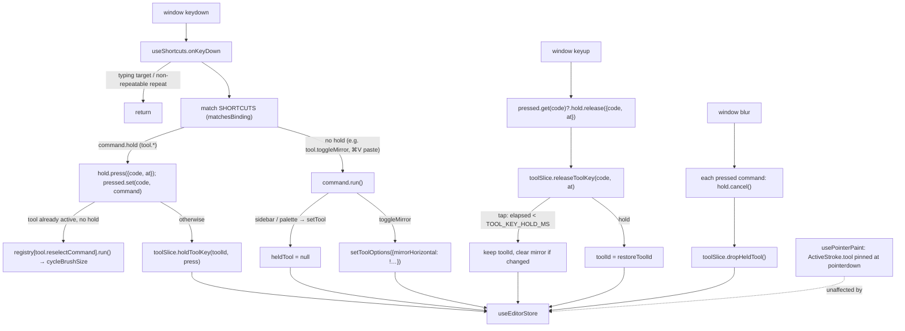

# Hold tool shortcuts (spring-loaded tool keys), `P` again, `V` mirror toggle

Status: proposed
Date: 2026-09-30
Issue: #5 "Eraser Holding Shortcut"

## Goal
In the pixel editor, every tool key (`P`, `E`, `B`, `G`, `O`, `S`) is spring-loaded:

- Keydown switches to the tool at once, as it does today.
- On keyup, a press shorter than `TOOL_KEY_HOLD_MS` (300 ms) was a tap, so the tool stays.
- A longer press was a hold, so the tool that was active before the hold comes back, with its
  options (mirror included) unchanged.

The hold-`Alt` temporary picker is **removed**, and holding `O` replaces it. With every hold now
coming from a tool key, the design gets simpler:

- One piece of slice state, `heldTool`, replaces `previousToolId` / `pushTemporaryTool` /
  `popTemporaryTool`.
- `Tool.holdKey`, `HELD_TOOL_KEYS`, `HeldModifier` and `toolKeys()` go away.
- One keyboard hook: `useShortcuts` dispatches holds through an optional `hold` part on commands,
  so `useHeldToolKeys` is deleted.

The same PR makes the `docs/shortcuts.md` rows for `P` and `V` true, since neither is wired up today:

- `P` pressed while the pencil is already active cycles the brush size 1→2→3→4. A size above 4
  (6 or 8, picked in the options bar) wraps to 1.
- `V` pressed while the pencil is active toggles "Mirror horizontally" (both sides of the vertical
  axis). It's the same option and the same effect as the options-bar button today. `V` is a plain
  shortcut and does not spring back.

## Non-goals
- No setting or UI for the threshold. It is a constant.
- No "revert only if a stroke happened during the hold" safeguard (Decision 2: considered, deferred).
- No spring-loading in the spritesheet builder. Its registry has no tool commands, so it has no
  hold commands.
- No new tool for `V`, no `V` hold, and no key for "Mirror vertically".
- No change to existing bindings apart from removing the Alt hold. The only new key is `V`.
  `P`-again reuses `P`.
- No change to how sidebar clicks, the command palette, Paste and Select all switch tools. They
  call `run()` → `setTool`.
- No deferring of a revert until the current stroke ends (Decision 10).
- No borrow stack. Only one held tool at a time (Decision 7).
- No replacement modifier hold. `Alt` stays free for chords (`Alt`+`,` / `Alt`+`.` move frames).
- Borrowing any tool while Select & move is active still drops the selection, as `Alt` did,
  because the selection only exists while its tool is active.
- The options-bar mirror buttons get no new tooltip. The cheat sheet lists `V`.

## Decisions
| # | Decision | Why | Rejected alternative |
|---|----------|-----|----------------------|
| 1 | **Settled by the maintainer.** The threshold is `TOOL_KEY_HOLD_MS = 300` in `src/constants/shortcuts.ts`. `keyup.timeStamp − keydown.timeStamp ≥ 300` counts as a hold. No timer | Both events share one time origin, and nothing needs to happen *at* 300 ms | `setTimeout` at keydown |
| 2 | **Settled by the maintainer: considered and deferred.** A pure time threshold, with no "only revert if a stroke happened during the hold" safeguard | It is predictable, and "hold O, look, let go" still reverts. The safeguard needs a stroke signal out of `usePointerPaint` | Implementing the safeguard now |
| 3 | **Settled by the maintainer.** Every tool with a `shortcut` takes part, Select & move (`S`) included | One rule for every tool key | A per-tool opt-out |
| 4 | **Settled by the maintainer. The Alt hold is removed, and holding `O` replaces it.** Delete `Tool.holdKey`, `HELD_TOOL_KEYS` and `HeldModifier`. `toolKeys()` is deleted, and callers use `commandKeys(\`tool.${id}\`)`. "Hold ⌥" disappears from the sidebar tooltip and the cheat sheet | Every hold is a tool key, so there is one rule. Hold `O` gives exactly the old behaviour. This also removes the need for a `tapKeeps` flag | Keeping Alt (needs `tapKeeps` and a modifier path). Rebinding the picker to `I`. Right-click to pick |
| 5 | **Settled by the maintainer. One state owner.** The slice's `heldTool: HeldTool \| null` replaces `previousToolId`. `holdToolKey` / `releaseToolKey` / `dropHeldTool` replace `pushTemporaryTool` / `popTemporaryTool`. The tap/hold decision is a pure slice transition | Nothing goes stale, and the rule is unit-testable with plain numbers (conventions §7) | Hold state in a hook |
| 6 | **Settled by the maintainer. One keyboard hook.** `CommandDefinition` gains an optional `hold: { press, release, cancel }`. On a matching keydown, `useShortcuts` calls `hold.press` instead of `run()` and remembers `code → command`. On that code's keyup it calls `hold.release`, and on window `blur` it calls `cancel` for every pressed command. Tool commands implement `hold` over the slice. `useHeldToolKeys` is deleted | There is no capture-phase claim, and `useShortcuts` needs no `defaultPrevented` skip, so the Escape risk goes away. Every key still resolves through the command registry (shortcuts.md rule 1, no exception). The hook stays editor-agnostic because the builder simply has no hold commands | A second hook that claims tool keys first (ordering tricks, and an exception to rule 1) |
| 7 | **Settled by the maintainer. Takeover.** A second held key during a hold replaces the holder (new tool, `code` and `pressedAt`), and `restoreToolId` is kept from the **first** hold (single level). Releasing the first key does nothing, because the slice ignores a code that isn't `heldTool.code`. The second key's release follows the tap/hold rule | Overlapping taps (`E↓ B↓ E↑ B↑`) end on `B`, and chained holds return to where you started | Ignoring the second key. A stack |
| 8 | Keydown **borrows** without touching `toolOptions`. A tap resolves as a real choice with `setTool`'s semantics (mirror cleared if the tool changed), and a hold restores `restoreToolId` with options untouched | At keydown, tap and hold can't be told apart. A hold returns to the pencil with its mirror intact, and a tap ends where clicking the tool would | `setTool` on keydown |
| 9 | A tool key matches its exact chord (`matchesBinding`), so `⌘/Ctrl+V`, `⌘/Ctrl+E`, `Shift+E` and `Alt+E` are never tool keys. The release is matched on **`event.code`** | `event.key` of a held letter changes if Shift or Option joins mid-hold | Matching the release on `event.key` |
| 10 | **Settled by the maintainer. Mid-stroke release:**<br>• Paint tools, fills and the picker: `usePointerPaint` pins `ActiveStroke.tool` at pointerdown, so the stroke finishes with the borrowed tool as one undo entry.<br>• A held `S` released mid-drag **cancels the move**. Deactivation runs `abandonDrag` (pixels go back), and `StrokeRecorder.commit()` returns null (no undo entry) | Verified in `usePointerPaint.ts`, `select.ts` and `history.ts`. It needs no new code | Deferring the revert to pointerup |
| 11 | `setTool` (sidebar, palette, Paste, Select all) clears `heldTool`. The pending release is then a no-op | An explicit choice beats a held key | Reverting anyway on keyup |
| 12 | A tool key for the **already active** tool, with no hold running, starts no hold. It runs the tool's `reselectCommand` if it has one, and otherwise does nothing. This lives in the tool command's `hold.press` | Nothing to hand back, and it is exactly the "press again" gesture | Recording a hold that restores the same tool |
| 13 | **`P` again = `tool.cycleBrushSize`.** `pencilTool.reselectCommand = "tool.cycleBrushSize"`. It fires once per physical press, because `useShortcuts` already drops non-repeatable repeats. Holding `P` from another tool is a normal hold | The command exists and only lacks a key. Declaring it on the tool keeps "tool keys live on the tool". It can't be an `APP_SHORTCUTS` entry, because `p` is already `tool.pencil` and the uniqueness test forbids a second binding | A `{key:"p"}` app shortcut (chord clash) |
| 14 | **Settled by the maintainer.** `cycleBrushSize` wraps any size of `MAX_CYCLE_BRUSH_SIZE` or more to 1: `size >= MAX_CYCLE_BRUSH_SIZE ? 1 : size + 1` | `(size % 4) + 1` sends 6→3 and 8→1 | Leaving it. Cycling through every `BRUSH_SIZES` entry |
| 15 | **Settled by the maintainer. `V` is a plain app command, `tool.toggleMirror`** ("Mirror horizontally", group `Tools`), bound to `{key:"v"}` in `APP_SHORTCUTS`. `isEnabled` is true when the active tool declares the `"mirror"` option (today only the pencil). `run` toggles `mirrorHorizontal` through `setToolOptions`, which is exactly what the options-bar button does. It has no `hold` and doesn't spring back | Matches today's mirror behaviour, with no new tool, factory, icon or preview change. When disabled, `useShortcuts` leaves the key alone. `v` and `mod+v` are different chords, so paste is unaffected | A separate Mirror pencil tool. `V` also switching to the pencil |
| 16 | Repeats and keydowns in typing targets are ignored, as `useShortcuts` does today. Keyup and blur are **not** filtered by target | A release that lands after focus moved into a field must still resolve | Filtering keyup too |
| 17 | Cheat sheet, leading **Tools** section:<br>• After the Pencil row comes "Cycle brush size" / "P again" (`reselectKeys(tool)`).<br>• "Mirror horizontally" / `V` comes from the command's group automatically.<br>• At the end comes "Use a tool until you let go" / "Hold tool key" (`TOOL_KEY_HOLD_HINT`, exported next to the tool commands).<br>• The picker row loses "Hold ⌥" | Hints live next to their code | "Hold X" on every row |
| 18 | The tap/hold logic is unit-tested on the slice with explicit timestamps. The hook's browser tests dispatch `KeyboardEvent`s with `timeStamp` overridden (`tests/support/keys.ts`) | Deterministic, with no 300 ms sleeps | Real waits |

## Call graph


## Interfaces
```ts
// src/constants/shortcuts.ts
/** A tool key held at least this long borrows the tool; a shorter press switches to it for good. */
export const TOOL_KEY_HOLD_MS = 300;
// APP_SHORTCUTS: + "tool.toggleMirror": [{ key: "v" }]

// src/constants/commands.ts: APP_COMMAND_IDS + "tool.toggleMirror"

// src/commands/types.ts
export interface KeyPress { code: string; at: number }
export interface CommandHold {
  press(key: KeyPress): void;
  release(key: KeyPress): void;
  /** The window lost focus mid-press: hand back whatever the press borrowed. */
  cancel(): void;
}
// CommandDefinition: + hold?: CommandHold   (a key bound to it calls hold instead of run)

// src/editor/tools/types.ts — Tool: − holdKey; +
/** Run when the tool's key is pressed while it is already active and no hold is running ("P again"). */
readonly reselectCommand?: AppCommandId;

// src/stores/slices/toolSlice.ts
export interface HeldTool {
  /** The physical key holding the tool (`KeyboardEvent.code`); only its release resolves the hold. */
  code: string;
  /** `KeyboardEvent.timeStamp` of that key's first keydown. */
  pressedAt: number;
  /** The tool active before the first key of this hold; kept through a takeover. */
  restoreToolId: ToolId;
}
// ToolSlice: + heldTool, holdToolKey(toolId, press), releaseToolKey(code, at), dropHeldTool()
//            setTool also clears heldTool; setTool and the tap path share `withoutMirror(options)`
//            cycleBrushSize wraps sizes >= MAX_CYCLE_BRUSH_SIZE to 1
//            − previousToolId, pushTemporaryTool, popTemporaryTool

// src/commands/keymap.ts: − HELD_TOOL_KEYS, − toolKeys; +
/** "P again" for a tool with a reselectCommand; empty otherwise. */
export function reselectKeys(tool: Tool<ToolId>): string[];

// src/commands/toolCommands.ts: +
export const TOOL_KEY_HOLD_HINT: Hint; // { action: "Use a tool until you let go", inputs: [{ text: "Hold tool key" }] }
```

Slice transitions (sketch):
```ts
holdToolKey(toolId, { code, at }):
  const { toolId: current, heldTool } = get();
  if (heldTool?.code === code) return;
  set({ toolId, heldTool: { code, pressedAt: at, restoreToolId: heldTool?.restoreToolId ?? current } });

releaseToolKey(code, at):
  const { heldTool, toolId, toolOptions } = get();
  if (!heldTool || heldTool.code !== code) return;
  const tap = at - heldTool.pressedAt < TOOL_KEY_HOLD_MS;
  set(tap
    ? { heldTool: null, toolOptions: toolId === heldTool.restoreToolId ? toolOptions : withoutMirror(toolOptions) }
    : { heldTool: null, toolId: heldTool.restoreToolId });

dropHeldTool(): if (heldTool) set({ heldTool: null, toolId: heldTool.restoreToolId });
```

Tool command (sketch, inside `createToolCommands`):
```ts
hold: {
  press: (key) => {
    const state = store.getState();
    if (state.toolId === toolId && !state.heldTool) {           // Decision 12
      const reselect = tool.reselectCommand && registry[tool.reselectCommand];
      if (reselect && reselect.isEnabled?.() !== false) reselect.run();
      return;
    }
    state.holdToolKey(toolId, key);
  },
  release: ({ code, at }) => store.getState().releaseToolKey(code, at),
  cancel: () => store.getState().dropHeldTool(),
},
```

`useShortcuts` (sketch; existing keydown logic unchanged except the `hold` branch):
```ts
const pressed = new Map<string, CommandDefinition>();         // per effect, keyed by event.code
onKeyDown: … matched command …
  event.preventDefault();
  if (command.hold) { command.hold.press({ code: event.code, at: event.timeStamp }); pressed.set(event.code, command); }
  else command.run();
onKeyUp(e):  const command = pressed.get(e.code); if (command) { pressed.delete(e.code); command.hold!.release({ code: e.code, at: e.timeStamp }); }
onBlur():    for (const command of pressed.values()) command.hold!.cancel(); pressed.clear();
cleanup:     remove listeners; cancel any still-pressed holds (a registry change mid-hold must not leave a borrowed tool)
```

## Files
- `src/constants/shortcuts.ts`: add `TOOL_KEY_HOLD_MS`, and add the `tool.toggleMirror` binding `v`. Serves 1, 9.
- `src/constants/commands.ts`: add `"tool.toggleMirror"` to `APP_COMMAND_IDS`. Serves 9.
- `src/commands/types.ts`: add the `KeyPress` and `CommandHold` types and `CommandDefinition.hold?`. Serves 1, 3, 4, 6.
- `src/commands/toolCommands.ts`:
  - Give each tool command its `hold` part.
  - Add the `tool.toggleMirror` command.
  - Add `TOOL_KEY_HOLD_HINT`.

  Serves 1–5, 8, 9, 11.
- `src/stores/slices/toolSlice.ts`:
  - Add the `heldTool` state and `holdToolKey` / `releaseToolKey` / `dropHeldTool`.
  - `setTool` clears `heldTool`, and `withoutMirror` is extracted for it and the tap path to share.
  - `cycleBrushSize` wraps sizes of 4 or more to 1.
  - Remove `previousToolId`, `pushTemporaryTool` and `popTemporaryTool`.

  Serves 1–4, 7, 8.
- `src/editor/tools/types.ts`: add `reselectCommand?` and remove `holdKey`. Serves 7, 8.
- `src/editor/tools/pencil.ts`: `reselectCommand: "tool.cycleBrushSize"`. Serves 8.
- `src/editor/tools/picker.ts`: remove `holdKey: "alt"`. Serves 5, 7.
- `src/lib/keys.ts`: remove `HeldModifier`. `formatModifier` stays, because hints use it. Serves 7.
- `src/commands/keymap.ts`: remove `HELD_TOOL_KEYS` and `toolKeys`, and add `reselectKeys`. Serves 7, 11.
- `src/hooks/useShortcuts.ts`: the `hold` dispatch, keyup, blur and cleanup, as sketched. Serves 1–4, 6.
- `src/hooks/useHeldToolKeys.ts`: **delete**. Serves 7.
- `src/components/editor/EditorPage.tsx`: remove the `useHeldToolKeys()` call. Serves 7.
- `src/components/editor/ToolSidebar.tsx` and `src/components/editor/ShortcutHelpDialog.tsx`:
  - `toolKeys(tool)` becomes `commandKeys(\`tool.${tool.id}\`)`.
  - The help dialog adds the reselect row after its tool, and `hintRow(TOOL_KEY_HOLD_HINT)` at the end.

  Serves 11.
- `docs/shortcuts.md`:
  - Tools table:
    - Intro: tap switches, holding for 0.3 s or longer borrows until you let go.
    - `P`: "press again (while the pencil is active) to cycle brush size 1→2→3→4".
    - `V`: becomes "Mirror horizontally (pencil): toggles drawing on both sides of the vertical axis".
    - `S`: releasing a held `S` drops the selection, and mid-drag cancels the move.
    - `O`: drop "`Alt` held = temporary picker" and say to hold `O` instead.
  - Remove the "`Alt`+click · Pick colour under cursor" row.
  - Implementation contract:
    - Replace the `holdKey` text with `Tool.reselectCommand` and `CommandDefinition.hold`.
    - Rule 1 stays true without exceptions.

  Serves 12.
- Tests are listed below. Serves 13.

## Test plan
Unit (`npm test`):
- `tests/unit/stores/toolSlice.test.ts`. Migrate the push/pop and "held modifier keeps mirroring" tests to the new API, then add:
  1. Tap: `holdToolKey("eraser",{code:"KeyE",at:0})`, then release at 299 → eraser, `heldTool` null, mirror cleared.
  2. Hold: release at 300 → pencil, mirror intact.
  3. Takeover as a tap: E at 0, B at 50, release KeyE at 80 → bucket, release KeyB at 120 → bucket.
  4. Takeover as a hold: E at 0, B at 400, release KeyE at 500 → no-op, release KeyB at 900 → pencil.
  5. A foreign code release is a no-op.
  6. `dropHeldTool` restores.
  7. `setTool` mid-hold clears the hold.
  8. `cycleBrushSize` from 4, 6 and 8 → 1, and from 1, 2 and 3 → the next size.
- `tests/unit/commands/toolCommands.test.ts` (new):
  - `hold.press` on the active tool with no hold runs its reselect command (pencil → brush size +1) and records no hold. Another tool without a reselect command does nothing.
  - `hold.press` from another tool calls `holdToolKey`.
  - `tool.toggleMirror`: `isEnabled` is true only when the active tool declares `"mirror"`, and `run` flips `mirrorHorizontal` and leaves `mirrorVertical` alone.
- `tests/unit/commands/keymap.test.ts`:
  - Remove the `HELD_TOOL_KEYS` and `toolKeys` tests.
  - `reselectKeys(pencil)` is `["P again"]`, and `reselectKeys(eraser)` is `[]`.
  - The uniqueness test stays green with `v` and `mod+v`.

Browser (`npm run test:browser`):
- `tests/support/keys.ts` (new): `keyDown(key, { code, at, repeat?, ctrlKey?, metaKey?, target? })` and `keyUp(…)`, with `timeStamp` overridden.
- `tests/browser/hooks/useShortcuts.browser.test.tsx`. Add, with a test registry holding a spy `hold` command:
  - A press then a release calls `press` and then `release` with code and timestamps, and never `run`.
  - A repeat doesn't call `press` again.
  - Blur calls `cancel`.
  - Unmounting mid-press calls `cancel`.
  - A keyup for a code that was never pressed calls nothing.
  - The existing tests stay green, including Escape.
- `tests/browser/tools/eraser.browser.test.tsx`:
  - "tapping E switches to the eraser for good".
  - "holding E borrows the eraser and hands the pencil back".
  - "releasing E mid-stroke keeps erasing to the end of the stroke": one undo entry, and the tool ends on pencil.
  - "blur mid-hold hands the pencil back".
  - "E typed in a text field does nothing".
  - "⌘/Ctrl+E doesn't switch tools".
- `tests/browser/tools/select.browser.test.tsx`:
  - "releasing a held S mid-move puts the pixels back and adds no undo step".
  - "tapping S keeps Select & move".
- `tests/browser/tools/pencil.browser.test.tsx`:
  - "P on the pencil cycles the brush size shown in the options bar 1→2→3→4→1".
  - "V toggles Mirror horizontally on the pencil (the options-bar button shows pressed), and a click paints the pixel and its twin".
  - "V on the eraser does nothing".
  - "⌘/Ctrl+V still pastes".
- `tests/browser/tools/picker.browser.test.tsx`: rewrite the Alt test as "holding O borrows the picker from the pencil, and releasing hands the pencil back". Add "holding Alt alone switches nothing".
- `tests/browser/tools/tool-matrix.browser.test.tsx`: the existing "typed into a text field" and "switched mid-stroke" tests stay green.
- `tests/browser/flows/core-editing.browser.test.tsx`: assert no "Hold ⌥" label remains, and that the "Cycle brush size", "Mirror horizontally" and "Use a tool until you let go" rows are in the Tools section.

Command: `npm run lint && npm run build && npm run test:coverage`

## Done when
- [ ] 1. From the pencil, a press of `E` under 300 ms leaves the eraser active, and 300 ms or more returns to the pencil. The same holds for `B`, `G`, `O` and `S`, and for `P` from any other tool.
- [ ] 2. A hold returns with mirror settings intact. A tap clears mirror exactly as clicking the tool does.
- [ ] 3. Repeats never restart the clock, and window blur during a hold restores the pre-hold tool.
- [ ] 4. `E↓ B↓ E↑ B↑` (fast) ends on the bucket, and the same sequence held long ends on the pencil.
- [ ] 5. Holding `Alt` does nothing on its own, and holding `O` borrows the picker.
- [ ] 6. `E` in a text field, `⌘/Ctrl+E`, `⌘/Ctrl+V` (paste still works), `Shift+E` and `Alt+E` never switch tools.
- [ ] 7. `useHeldToolKeys`, `previousToolId`, `pushTemporaryTool`, `popTemporaryTool`, `holdKey`, `HELD_TOOL_KEYS`, `HeldModifier` and `toolKeys` no longer exist (`grep` is empty).
- [ ] 8. On an active pencil with no hold, each `P` press cycles 1→2→3→4→1, and a brush of 6 or 8 goes to 1.
- [ ] 9. `V` on the pencil toggles Mirror horizontally, exactly like the options-bar button. `V` on any other tool does nothing.
- [ ] 10. A held `S` released mid-drag leaves the pixels where they started and no new undo entry.
- [ ] 11. The `?` sheet's Tools section has the "Cycle brush size · P again", "Mirror horizontally · V" and "Use a tool until you let go · Hold tool key" rows, and no "Hold ⌥".
- [ ] 12. `docs/shortcuts.md` matches all of the above.
- [ ] 13. Every test listed above exists, and the command above passes.

## Open risks
- Linux/X11 auto-repeat has historically produced synthetic keyup/keydown pairs. Chromium filters
  them, but other engines may not, and a long hold there could read as taps. This can't be checked on CI.
- The `timeStamp` override on synthetic events is assumed to work in Chromium. If it doesn't,
  `keys.ts` falls back to a real wait of `TOOL_KEY_HOLD_MS`.
- Users coming from Piskel expect `Alt` for the picker. Mention hold `O` in the release notes.

## Open questions for the maintainer
None. All were settled on 2026-09-30.

## Drift log
